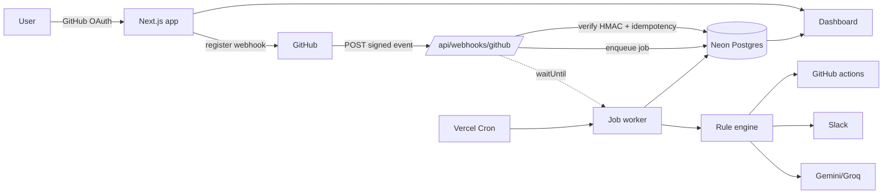
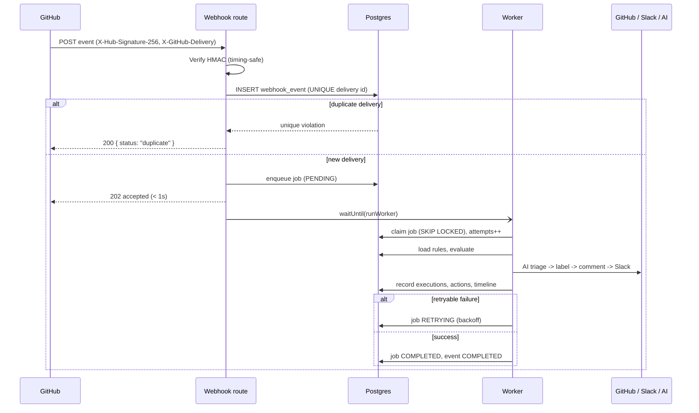

# GitFlow Automator

Event-driven GitHub automation bot. It receives **cryptographically verified**
GitHub webhooks, evaluates **configurable rules**, takes **real actions on
GitHub** (labels, comments), sends **Slack notifications**, optionally runs
**AI triage**, and records every execution — retries and failures included — in a
**live authenticated dashboard**.

Built to run entirely on **free tiers, no credit card**: Vercel + Neon Postgres +
GitHub OAuth + Slack Incoming Webhooks + Google Gemini (or Groq).

---

## Overview



## Features

- **GitHub OAuth** sign-in with encrypted-at-rest token storage.
- **Automatic webhook registration** per connected repository (with a per-repo
  signing secret).
- **Signature verification** (`X-Hub-Signature-256`, HMAC-SHA256, timing-safe).
- **Idempotency** via a `UNIQUE(githubDeliveryId)` constraint — duplicates and
  concurrent deliveries never double-process.
- **Postgres-backed job queue** with `FOR UPDATE SKIP LOCKED` claiming and
  exponential-backoff retries (no Redis).
- **Configurable rule engine** — match on event type, title, body, author,
  labels; run label / comment / Slack / AI actions. Rules are data, not code.
- **GitHub write actions** that check current state first (never adds a label
  that already exists).
- **Slack notifications** with graceful, retryable failure handling.
- **AI triage** (optional) returning validated JSON: summary, category,
  priority, suggested label.
- **Live dashboard**: events, matched rules, actions, retries, failures, an
  execution timeline per event, rule management, repo management, Slack config.
- **Structured logging** with automatic secret redaction and correlation IDs.
- **Health check** at `/api/health`.

## Event Flow



## Tech Stack

| Layer      | Choice                                             |
| ---------- | -------------------------------------------------- |
| Framework  | Next.js 15 (App Router) + TypeScript               |
| UI         | Tailwind CSS v4, custom shadcn-style components    |
| Data       | TanStack Query (client), Prisma ORM (server)       |
| Auth       | Auth.js (NextAuth v5), GitHub provider, JWT session|
| Database   | PostgreSQL (Neon)                                  |
| Queue      | PostgreSQL-backed jobs + Vercel Cron + `waitUntil` |
| AI         | Google Gemini or Groq (free tier)                  |
| Deploy     | Vercel                                             |
| Tests      | Vitest                                             |

## Project Structure

```
src/
  app/
    api/                 route handlers (webhook, cron, rules, events, …)
    dashboard/           authenticated pages
    login/  page.tsx     public pages
  components/            UI primitives + dashboard components
  lib/                   env, utils, client API helpers
  server/
    auth/                NextAuth config (edge-safe split) + session helpers
    github/              REST client, repo connect, token access
    slack/               Slack client
    ai/                  triage service (Gemini/Groq) with schema validation
    webhook/             signature verify + normalize/sanitize
    automation/          rule engine, action executor, processor, timeline
    queue/               Postgres job queue + worker
    security/            crypto (AES-256-GCM), rate limiting
    database/            Prisma client
    logger/              structured logging + redaction
prisma/schema.prisma     data model + migrations
tests/                   Vitest unit + mocked tests
```

## Local Development

```bash
git clone https://github.com/bobby-nandigam/git-flow.git
cd git-flow

npm install
cp .env.example .env.local     # then fill in the values (see below)

npm run db:migrate             # create tables in your Neon DB
npm run dev                    # http://localhost:3000
```

Run the tests:

```bash
npm test
```

### Local webhook testing

GitHub can't reach `localhost`. Use a tunnel:

```bash
# example with cloudflared (free, no account):
cloudflared tunnel --url http://localhost:3000
```

Set `APP_PUBLIC_URL` and `AUTH_URL` to the tunnel URL, restart `npm run dev`, and
connect a repository — the webhook is registered against the tunnel. Because the
Vercel Cron sweep doesn't run locally, background jobs are processed by the
webhook's `waitUntil` path; you can also trigger the sweep manually:

```bash
curl -H "Authorization: Bearer $WORKER_SECRET" http://localhost:3000/api/cron/process-jobs
```

## Environment Variables

See `.env.example` for the annotated list. Summary:

| Variable | Required | Purpose |
| --- | --- | --- |
| `DATABASE_URL` | yes | Neon pooled connection (runtime) |
| `DATABASE_URL_UNPOOLED` | yes | Neon direct connection for `prisma migrate` (auto-set by Neon's Vercel integration) |
| `AUTH_SECRET` | yes | Session signing + secret encryption key (`openssl rand -base64 32`) |
| `GITHUB_CLIENT_ID` / `GITHUB_CLIENT_SECRET` | yes | OAuth app |
| `GITHUB_WEBHOOK_SECRET` | yes | Fallback/global webhook signing secret (`openssl rand -hex 32`) |
| `WORKER_SECRET` | yes | Protects the cron/worker endpoint (`openssl rand -hex 32`) |
| `AUTH_URL` / `NEXTAUTH_URL` | no | Public base URL. Optional in production — the app sets `trustHost` and infers it from the request; set it only for local tunnels. |
| `APP_PUBLIC_URL` | no | Base URL used to build the webhook payload URL; falls back to `AUTH_URL`, then the request host |
| `SLACK_WEBHOOK_URL` | no | Fallback Slack webhook (per-repo config lives in DB) |
| `AI_PROVIDER` | no | `gemini` \| `groq` \| `none` |
| `GEMINI_API_KEY` / `GEMINI_MODEL` | no | Gemini triage |
| `GROQ_API_KEY` / `GROQ_MODEL` | no | Groq triage |

## GitHub OAuth Setup

1. Go to **GitHub → Settings → Developer settings → OAuth Apps → New OAuth App**.
2. **Homepage URL**: `https://YOUR_DOMAIN`
3. **Authorization callback URL**: `https://YOUR_DOMAIN/api/auth/callback/github`
4. Copy the **Client ID** and generate a **Client secret** into your env.

Requested scopes (minimal): `read:user user:email repo admin:repo_hook`.
`repo` + `admin:repo_hook` are needed to register webhooks and to label/comment
on issues & PRs, including private repositories.

## GitHub Webhook Setup

**Automatic (recommended):** connecting a repository in the dashboard registers
the webhook for you with a unique per-repo secret. Nothing else to do.

**Manual (optional):** in a repo's **Settings → Webhooks → Add webhook**:

- **Payload URL**: `https://YOUR_DOMAIN/api/webhooks/github`
- **Content type**: `application/json`
- **Secret**: your `GITHUB_WEBHOOK_SECRET`
- **Events**: Issues, Pull requests, Pushes

## Slack Setup

1. Create a Slack app → **Incoming Webhooks** → **Add New Webhook to Workspace**.
2. Copy the `https://hooks.slack.com/services/…` URL.
3. In the dashboard **Slack** page, paste it (account-wide or per-repo) and
   "Save & send test". The URL is encrypted at rest and never returned to the UI.

## AI Setup

- **Gemini (default):** get a key at
  <https://aistudio.google.com/app/apikey>, set `AI_PROVIDER=gemini` and
  `GEMINI_API_KEY`.
- **Groq (alternative):** get a key at <https://console.groq.com/keys>, set
  `AI_PROVIDER=groq` and `GROQ_API_KEY`.

AI is optional. When unconfigured or failing, AI actions are marked
skipped/failed and the rest of the automation continues — the event is never
lost.

## Database Setup

1. Create a free Neon project at <https://neon.tech> (no credit card), or add the
   **Neon** integration from the Vercel Marketplace — it provisions the database
   and injects `DATABASE_URL`, `DATABASE_URL_UNPOOLED` and friends into the
   project automatically.
2. For local dev, copy the **pooled** connection string into `DATABASE_URL` and
   the **direct** (unpooled) one into `DATABASE_URL_UNPOOLED`.
3. `npm run db:migrate` (local). On Vercel, `prisma migrate deploy` runs
   automatically as part of the build (see Deployment).

## Deployment

Deployed on **Vercel** at <https://abstrabit.vercel.app>.

1. Push the repo to GitHub and import it into **Vercel** (or `vercel link` an
   existing project).
2. Add the **Neon** database (Vercel Marketplace → Storage). It injects
   `DATABASE_URL` and `DATABASE_URL_UNPOOLED` into all environments.
3. Add the remaining secrets to the project (Production, Preview, Development):

   ```bash
   for e in production preview development; do
     printf '%s' "$(openssl rand -base64 32)" | vercel env add AUTH_SECRET "$e"
     printf '%s' "$(openssl rand -hex 32)"    | vercel env add GITHUB_WEBHOOK_SECRET "$e"
     printf '%s' "$(openssl rand -hex 32)"    | vercel env add WORKER_SECRET "$e"
     printf '%s' "<client-id>"                | vercel env add GITHUB_CLIENT_ID "$e"
     printf '%s' "<client-secret>"            | vercel env add GITHUB_CLIENT_SECRET "$e"
   done
   ```

4. Create a GitHub OAuth App and set its **Authorization callback URL** to
   `https://YOUR_DOMAIN/api/auth/callback/github`.
5. Deploy: `vercel --prod`. Migrations run automatically — `vercel.json` sets the
   build command to `prisma generate && prisma migrate deploy && next build`, so
   the Neon schema is applied on every deploy.
6. `vercel.json` also registers the cron sweep for `/api/cron/process-jobs`.

`AUTH_URL`/`NEXTAUTH_URL`/`APP_PUBLIC_URL` are optional in production (the app
uses `trustHost` and infers the URL from the request).

> **Free-plan note:** Vercel Hobby cron runs at most **once per day**. The
> primary processing path is the webhook's `waitUntil` (immediate) — the cron is
> a safety net. For sub-daily retry sweeps on the free plan, point a free
> external scheduler (e.g. cron-job.org) at
> `POST https://YOUR_DOMAIN/api/cron/process-jobs` with header
> `Authorization: Bearer <WORKER_SECRET>` every minute.

## Production Architecture

- **Webhook route** does only: rate-limit → verify → idempotent persist →
  enqueue → respond (`< 1s`). No downstream API calls block the ack.
- **Worker** (`runWorker`) is invoked by both `waitUntil` (fast path) and the
  cron sweep (retries/safety). Jobs are claimed atomically with
  `FOR UPDATE SKIP LOCKED`, so the two paths never collide.
- **Rule engine** is pure and deterministic; **action executor** performs side
  effects and records each `ActionExecution`.
- **Fluid Compute** keeps instances warm; the in-memory rate limiter is
  best-effort and complemented by Vercel WAF for hard limits.

## Security

- HMAC-SHA256 webhook verification with timing-safe comparison; requests with a
  missing/invalid signature or malformed body are rejected before any trust.
- OAuth `state` handled by Auth.js; sessions are HTTP-only JWT cookies.
- Secrets (GitHub tokens, Slack URLs, per-repo webhook secrets) are
  **AES-256-GCM encrypted at rest** with a key derived from `AUTH_SECRET`.
- Every API route enforces authentication and **ownership** checks
  (`currentUser → repository/rule → access`). One user can never read or mutate
  another's data.
- All input validated with Zod; DB access is exclusively through Prisma
  (parameterised — SQL-injection safe). No raw HTML rendering (XSS-safe React).
- Structured logs **redact** secrets/tokens/cookies automatically.
- `.env` is git-ignored; `.env.example` holds placeholders only.

## Reliability & Idempotency

- `WebhookEvent.githubDeliveryId` is `UNIQUE`. A duplicate (or concurrent)
  delivery hits the constraint and returns `200 { status: "duplicate" }` without
  reprocessing.
- One `Job` per event (`webhookEventId` unique). Retries reuse the same job.
- `AutomationExecution` is unique per `(webhookEventId, ruleId)`, and completed
  events short-circuit — so a retried job never duplicates executions.
- GitHub label actions check current labels first; already-succeeded actions are
  skipped on retry so Slack/labels aren't duplicated.

## Retry Strategy

Attempts and backoff (see `src/server/queue/queue.ts`):

| Attempt | Delay before it runs |
| ------- | -------------------- |
| 1 | immediate |
| 2 | 5 s |
| 3 | 30 s |
| 4 | 2 min |
| 5 | 5 min |
| after 5 | terminal `FAILED` (dead-letter), surfaced on the dashboard |

Permanent failures (invalid GitHub token, validation errors, malformed AI
output) are **not** retried. Transient failures (5xx, rate limits, network) are.

## Replay Protection

The delivery ID uniqueness constraint is the core replay defense: the same
delivery ID can only ever be recorded once, so a replayed payload (same body,
same signature, same id) is rejected as a duplicate. Signature verification
additionally guarantees a replayed body can't be altered. A future hardening
step (documented in *Future Improvements*) is to also reject deliveries whose
timestamp is far in the past.

## Testing

```bash
npm test
```

Covers: signature verification (valid/invalid/missing/tampered), event-type
mapping, rule matching (contains/equals/labels/AND/disabled), backoff schedule,
payload normalization/sanitization, secret encryption round-trip + tamper
detection, AI output validation, enqueue idempotency (P2002), **label-dedup**
(skips when the label already exists), and the auth guard.

## Demo Instructions

1. Sign in with GitHub.
2. **Repositories → Connect repository** (a webhook is registered).
3. **Rules → New rule**: trigger *Issue opened*, condition *title contains
   "bug"*, actions *Add label `bug`* + *Slack* + *AI triage*.
4. Open an issue titled `Bug: Login fails on mobile` in that repo.
5. Watch **Overview / Events** update: the event arrives, the rule matches, the
   `bug` label appears on the issue, Slack is notified, AI triage completes.
6. Click the event to see the full execution timeline.

## Troubleshooting

- **Webhook shows "invalid signature":** the secret in GitHub doesn't match.
  Reconnect the repository (auto-sets a fresh secret) or align
  `GITHUB_WEBHOOK_SECRET`.
- **Repo won't connect / 403:** you need **admin** permission on the repo.
- **"webhook may already exist" (PENDING):** remove the old hook in the repo's
  webhook settings, then reconnect.
- **AI actions skipped:** `AI_PROVIDER`/API key not set — expected and safe.
- **Retries slow in production:** on Vercel Hobby the cron is daily; add an
  external minute scheduler hitting the worker endpoint (see Deployment).

## Future Improvements

- GitHub **App** installation (JWT + short-lived installation tokens) instead of
  broad OAuth scopes.
- Distributed workers + a dedicated dead-letter view.
- Timestamp-based replay window rejection.
- Richer rule DSL (OR groups, regex, numeric comparisons) and an audit log.
- More integrations (Discord, email) and per-rule metrics/SLOs.
```
